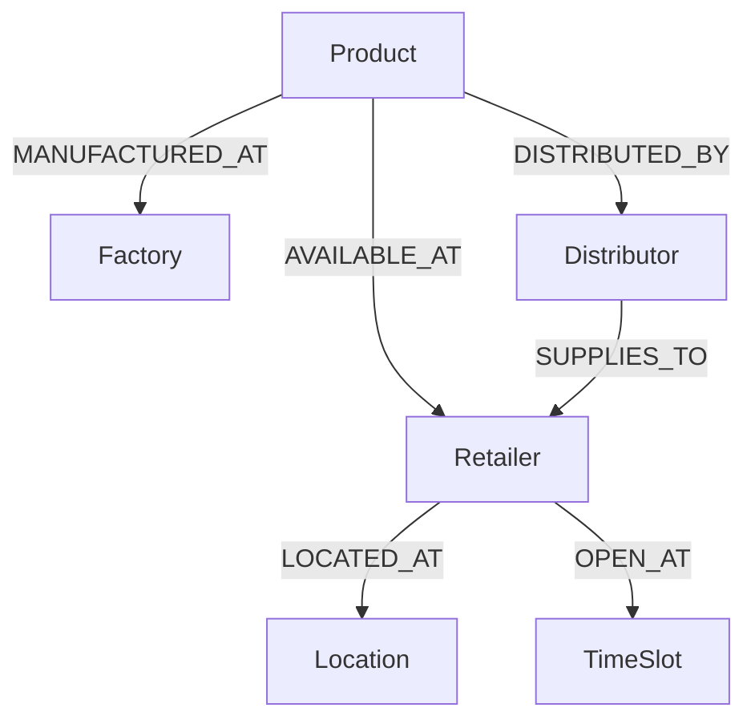

# 🧞‍♂️ AI Assistant for product discovery

*A demo showcasing how a Lebanese retail company can use Knowledge Graphs + LLMs to power customer and business insights.*

## 🎯 **What It Does**

For example, let's consider questions about a food products company

### For Customers:
- **Dietary Questions**: *"As a celiac, what sweet products can I get?"*
- **Product Availability**: *"Is there lactose-free fat-free milk?"*
- **Store Hours**: *"Which stores are open on Sunday afternoon?"*

### For Staff:
- **Distribution Insights**: *"Which distributors cover the most retailers in Beirut?"*
- **Product Analysis**: *"What are our most widely available products?"*

## 🚀 **Try the Live Demo**
Ask the assistant:
- *"Which products are gluten-free?"*
- *"Where can I find hummus in Achrafieh open after 6pm?"*
- *"What products are available at Spinneys Gemmayzeh?"*

## 📊 **Knowledge Graph Schema**

## License
[MIT](LICENSE) © Marwa Maghnie